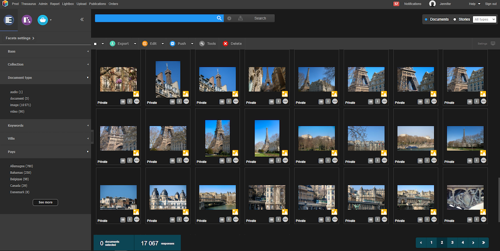
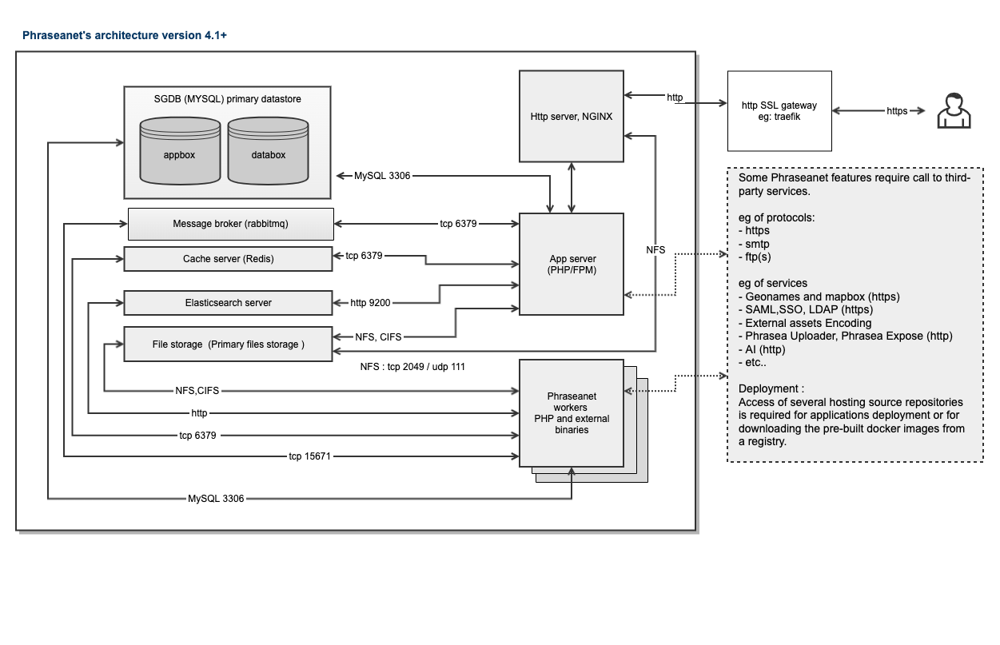

Phraseanet 4.1 - Digital Asset Management application
=====================================================

[](https://github.com/alchemy-fr/Phraseanet/actions/workflows/ci.yml)

# Main Features :

 - Several GUI : Prod, Admin, Thesaurus, Lightbox, Report,    
 - Metadata Management (includes Thesaurus and DublinCore Mapping)
 - RestFull APIS
 - Elasticsearch search engine
 - Multiple resolution assets generation
 - Advanced Rights Management
 - Duplicates management
 - SSO
 - Thesaurus
 - Publications
 - Collaborative editing and approval process
 - Video tools
 - Rich ecosystem: Plugins for Wordpress, Drupal and Adobe Creative Suite.
   
 and much more 



# License :

Phraseanet is licensed under GPL-v3 license.

# Documentation :

https://docs.phraseanet.com/

For development with Phraseanet API, see https://docs.phraseanet.com/4.1/en/Devel/index.html


# Installation and Quick Launch:


You can download a packaged version here:

https://www.phraseanet.com/en/download/


You can also ```git clone``` this repository for dev and/or test. 


In each case, Phraseanet includes Dockerfile for building images and ```Docker compose``` deployment.


See below for more information about Prerequisites and how to personalize the stack deployed. 


But in fact, if you have Docker Prerequisites, Phraseanet can be deployed and installed with these 2 simple commands.

In a terminal from the Phraseanet repository launch 


    
    docker compose build
    docker compose up -d 
     

After installation process, the default parameters allow you to reach the app on : `http://localhost:8082`
Default see Phraseanet credentials defined in .env file.

    PHRASEANET_ADMIN_ACCOUNT_EMAIL

    PHRASEANET_ADMIN_ACCOUNT_PASSWORD


> Note : This install will be made with default password for all services.
> Except for a test, This is VERY important to customize .env file and define your own password.   


For installation on your own mono-tenant or multi-tenant infrastructure (mysql, elasticsearch, redis, etc) stack,
follow the install steps described at 

https://docs.phraseanet.com/4.1/en/Admin/Install.html


We do not recommend using this method anymore.


## Need help implementing Phraseanet? 


Ask the community: https://groups.google.com/g/phrasea-install-en

Get official support : https://www.alchemy.fr/en/rubrique/services/


# Phraseanet with Docker:

## Prerequisites


- docker >=v20.10.24

In the stack Docker, Docker Compose included in this repo starts by default in test mode. 
All services are launched in a separate container and except "Phraseanet app" and "workers" containers, 
it can be replaced by an external service.
This is especially recommended to use your SGBD (Mariadb or MySql) service for a production use. 
The SGBD is one of primary Datastore, running the container included in this stack in "Production"
required some tuning regarding the volumes of your datas.

Filer service is provided by the hosts.

All port numbers are the default service given by the vendor and can be changed with ENV Variables except for the NFS.

For dev and testing, the stack include also some Tools containers and can be launched by compositing the stack.

eg :

 - Builder

 - Mailhog

 - Pma etc...

Refer to ```.env``` file and ```docker compose``` files or on documentation for stack compositing.

https://docs.phraseanet.com/4.1/en/Admin/EnvironnementVariables.html





Note about elasticsearch container, check this link

https://www.elastic.co/guide/en/elasticsearch/reference/current/docker.html#docker-prod-prerequisites


### What is docker? Read this:   

https://www.docker.com/get-started


### Host requirement:

Linux : https://hub.docker.com/search?q=&type=edition&offering=community&operating_system=linux


Macintosh : https://hub.docker.com/editions/community/docker-ce-desktop-mac


Windows : https://hub.docker.com/editions/community/docker-ce-desktop-windows

> Note: All our images are Linux based, so with Macintosh and Windows hosts, the containers run in vm provided by Docker. 
> For optimal performances, prefer a Linux host.


## Stack description and customization

We provide a Dockerfile for build images and several ```docker-compose...``` for deployment. 

Use ```COMPOSE_FILE``` and ```COMPOSE_PROFILES``` env variables for composing this deployment.

By default ```COMPOSE_FILE``` and ```COMPOSE_PROFILES``` is set for deploying a test stack including containers.

    
    phraseanet_db_1                 
    phraseanet_elasticsearch_1                                                              
    phraseanet_gateway_1                                                            
    phraseanet_mailhog_1                                  
    phraseanet_phraseanet_1                                                                       
    phraseanet_rabbitmq_1
    phraseanet_redis_1                                                                                    
    phraseanet_worker_1 
    

At first launch of the stack, the `Setup` container plays install.
It will restart until it can do this installation: waiting for readiness of all other containers.
At each container starting , `setup` container reaplying also some ```PHRASEANET_*``` environement variable into 
Phraseanet ```configuration.yml``` file.

default configuration is 

````
COMPOSE_FILE=docker-compose.yml:docker-compose.datastores.yml:docker-compose.tools.yml
COMPOSE_PROFILES=app,gateway-classic,db,pma,elasticsearch,redis,redis-session,rabbitmq,workers,mailhog,setup
````


You should review the default env variables defined in `.env` file.
Use `export` method to override these values.

i.e:
```bash
export PHRASEANET_DOCKER_TAG=latest
export INSTALL_ACCOUNT_EMAIL=foo@bar.com
export INSTALL_ACCOUNT_PASSWORD=$3cr3t!
export PHRASEANET_APP_PORT=8082
```
If you are not interested in the development of Phraseanet, you can ignore everything in `.env` after the `DEV Purpose` part.


### Using a env.local method for custom .env values

It may be easier to deal with a local file to manage our env variables.

You can add your `env.local` at the root of this project and define a command function in your `~/.bashrc` or `~/.zshrc`:

```bash
#######################################
# Docker compose helper:
#   Locate first defined environment
#   file and inject variables found in
#   docker compose command.
# Arguments:
#   command (string)
# Usage example:
#   dc up -d
#######################################

function dc() {
  for envFile in {".env.local","env.local"}; do
    if [ -f ${envFile} ]; then
      docker compose --env-file=.env --env-file=${envFile} $@
      return
    fi
  done

  docker compose $@
}
```
> Note that helper function only works with `"docker compose"` .

### Phraseanet Docker Images

You have two choices 

#### Use the prebuild image from dockerhub, see DockerHub section bellow for more information.
 
set env var  
```PHRASEANET_DOCKER_REGISTRY```

i.e:
```bash
# Registry from where you pull Docker images
PHRASEANET_DOCKER_REGISTRY=alchemyfr
```
and launch

```docker compose pull```

> Pulling images from Docker Hub takes ~ 3 minutes, depending on your bandwith


#### Build local images 

launch 

```docker compose build```


> The first build takes ~ 30 minutes on host without any Docker building cache, depending on your bandwith and the host capacity.


### Running the application


    docker compose up -d


The default parameters allow you to reach the app with : `http://localhost:8082`


### Phraseanet images from Docker Hub


Retrieve on Docker Hub prebuilt images for Phraseanet.


    https://hub.docker.com/r/alchemyfr/phraseanet-fpm

    https://hub.docker.com/r/alchemyfr/phraseanet-worker

    https://hub.docker.com/r/alchemyfr/phraseanet-nginx

    https://hub.docker.com/repository/docker/alchemyfr/phraseanet-db

    https://hub.docker.com/repository/docker/alchemyfr/phraseanet-elasticsearch


#### Tag organization on Docker Hub 

```latest``` : latest stable version

```4.1.2``` : Phraseanet version 4.1.2

```4.1.1``` : Phraseanet version 4.1.1


Etc


```nightly``` : Development version, the latest version with successful automated tests. Built and published every night


## Development mode


The development mode uses the `docker-compose-override.yml` file, so you need to set ```COMPOSE_FILE``` and ```COMPOSE_PROFILE``` env

````
COMPOSE_FILE=docker-compose.yml:docker-compose.datastores.yml:docker-compose.tools.yml:docker-compose.override.yml
COMPOSE_PROFILES=app,gateway-classic,db,pma,elasticsearch,redis,rabbitmq,workers,mailhog,builder
````


You can run it with:

    docker compose up -d

The environment is not ready yet: you have to fetch all dependencies.

This can be made easily from the builder container:

    docker compose run --rm -u app builder make install install_composer_dev

> Please note that the phraseanet image does not contain nor `composer` neither `node` tools. This allows the final image to be light.
> If you need to use dev tools, ensure you are running the `builder` image!


### Developer shell

You can also obtain a shell access in builder container:

```bash
docker compose run --rm builder /bin/bash
# or
docker compose run --rm builder /bin/zsh
```

In this container you will have the same libraries (PHP, Node, composer, ...) that are used to build images.
Also you have utils for development like telnet, ping, ssh, git, ...
Your $HOME/.ssh directory is also mounted to builder's home with your ssh agent.

### Using Xdebug

Xdebug is enabled by default with the `docker-compose.override.yml`
You can disable it by setting:

```bash
export XDEBUG_ENABLED=0
```

Remote host is fixed because of the subnet network from compose.

You need to configure file mapping in your IDE.
For PhpStorm, you can follow this example:


> Configure the `Absolute path on the server` to `/var/alchemy/Phraseanet` at the project root path (i.e. `~/projects/Phraseanet`).

#### Xdebug on MacOS

You have to set the following env:
```bash
XDEBUG_REMOTE_HOST=host.docker.internal
```

> Don't forget to recreate your container (`docker compose up -d phraseanet`)

### Build images with plugins

Plugins can be installed during build if you set the `PHRASEANET_PLUGINS` env var as follows:

```bash
PHRASEANET_PLUGINS="https://github.com/alchemy-fr/Phraseanet-plugin-expose.git"

# You can optionally precise the branch to install
# If not precised, the main branch will be pulled
PHRASEANET_PLUGINS="git@github.com:alchemy-fr/Phraseanet-plugin-webgallery.git(custom-branch)"

# Plugins are separated by semicolons
PHRASEANET_PLUGINS="git@github.com:foo/bar.git(branch-1);git@github.com:baz/42.git"
```

> Prefer the HTTPS URL for public repositories, you will not be required to provide your SSH key.

If you install private plugins, make sure you export your SSH private key content in order to allow docker build to access the GIT repository:
Also ensure you're using the SSH URL form (i.e: `git@github.com:alchemy-fr/repo.git`).
```bash
export PHRASEANET_SSH_PRIVATE_KEY=$(cat ~/.ssh/id_rsa)
# or if your private key is protected by a passphrase:
export PHRASEANET_SSH_PRIVATE_KEY=$(openssl rsa -in ~/.ssh/id_rsa -out /tmp/id_rsa_raw && cat /tmp/id_rsa_raw && rm /tmp/id_rsa_raw)
```

#### Running workers

```bash
docker compose -f docker-compose.yml run --rm worker <command>
```

Where `<command>` can be:

- `bin/console worker:execute -m 2` (default)
- `bin/console task-manager:scheduler:run`
- ...

# Try Phraseanet with Pre installed VM (deprecated)

You can also download a testing pre installed Virtual Machine in OVA format here :

https://www.phraseanet.com/download/


